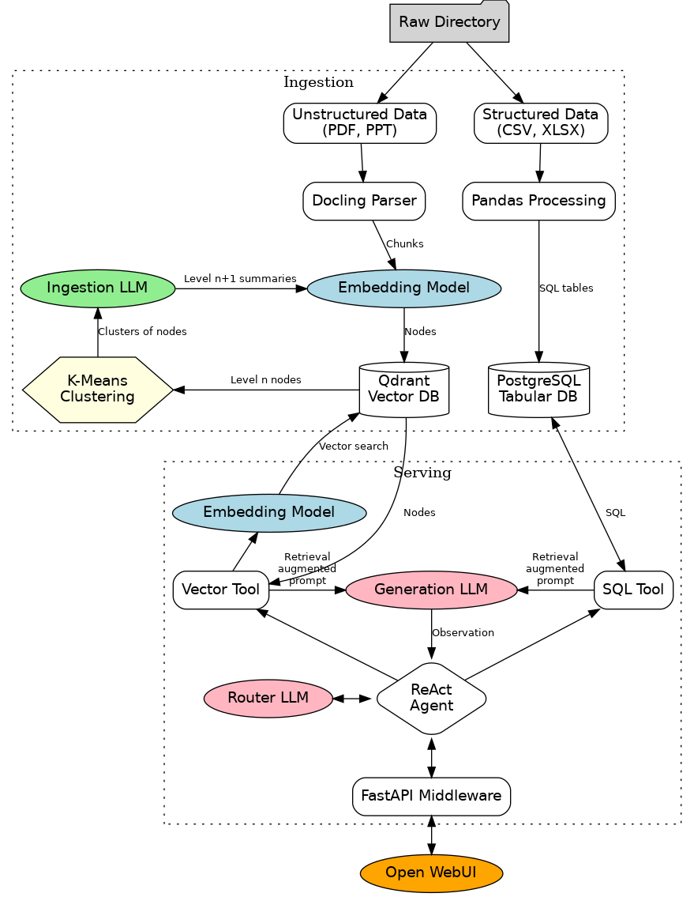

<!-- 
An enterprise "brain" using AI that knows the company's documents
(pdfs, power point slide decks, spreadsheets).

Able to summarize, synthesize, and answer questions about the
knowledge in the corpus. Answers have citations of supporting docs.

Corpus: Up to 1TB of documents

Runs locally on a NDVIDIA GDX Spark or less.
-->

# Angol - High-level design

- [Objective](#objective)
- [Overview](#overview)
- [Detailed Design](#detailed-design)
  - [1. Ingestion Layer](#1-ingestion-layer)
    - [1.1 Parsing](#11-parsing)
    - [1.2 Chunking & Embedding](#12-chunking--embedding)
    - [1.3 Clustering & Summarization (RAPTOR Pipeline)](#13-clustering--summarization-raptor-pipeline)
  - [2. Storage Layer](#2-storage-layer)
  - [3. Serving Layer](#3-serving-layer)
    - [Step 1: Query translation](#step-1-query-translation)
    - [Step 2: Retrieval](#step-2-retrieval)
    - [Step 3: Context Assembly](#step-3-context-assembly)
    - [Step 4: Observation and Final Generation](#step-4-observation-and-final-generation)
  - [4. User Interface](#4-user-interface)
- [Quantitative Estimates](#quantitative-estimates)
- [Design Alternatives](#design-alternatives)
- [Notes](#notes)
- [Author(s)](#authors)

## Objective
To build a highly secure, locally deployed (air-gapped) Enterprise AI system capable of ingesting large volumes of heterogeneous corporate documents (PDFs, PPTs, Spreadsheets). The system will provide accurate, reasoned answers to both granular and global queries, synthesize knowledge across multiple documents, and explicitly cite supporting sources. 

## Overview
The system utilizes an advanced Retrieval-Augmented Generation (RAG) architecture enhanced by the RAPTOR (Recursive Abstractive Processing for Tree-Organized Retrieval) methodology. Rather than relying on simple semantic similarity, the system builds a hierarchical Knowledge Tree. It clusters related document chunks, summarizes them using a local Large Language Model (LLM), and recursively embeds the summaries. This dual-pipeline architecture (Ingestion and Retrieval) runs entirely on open-source and open-weight software optimized for an NVIDIA DGX Spark (128GB RAM limit).

## Detailed Design

### 1. Ingestion Layer
#### 1.1 Parsing
*   **Document Extraction:** Uses IBM's [Docling](https://github.com/DS4SD/docling) or [Unstructured](https://unstructured.io/) to parse documents, including complex layouts and slide decks via specialized Vision/OCR models.
*   **Spreadsheet Parsing:** Datasets from CSV or spreadsheet files are ingested into a local PostgreSQL database for Text-to-SQL agentic querying.
*   **Metadata Tagging:** Every chunk is aggressively tagged with metadata (Author, Date, Department, Page Number, Document ID) to enable accurate citation generation down the pipeline.

#### 1.2 Chunking & Embedding
*   **Pipeline Management:** [LlamaIndex](https://www.llamaindex.ai/) manages chunking and RAG pipelines.
*   **Chunking Strategy:** Semantic chunking targeting ~2KB of text (roughly 500 tokens) per chunk.
*   **Embedding Model:** [BAAI BGE-M3](https://huggingface.co/BAAI/bge-m3). Handles massive context windows, supports multi-linguality, and generates dense vectors at 1024 dimensions.

#### 1.3 Clustering & Summarization (RAPTOR Pipeline)
To enable holistic reasoning across the corpus, data is grouped and summarized hierarchically:
*   **Metadata Partitioning:** Vectors are first bucketed by metadata (e.g., Department, Year) into batches of 20,000 to 40,000 chunks to prevent memory overflow.
*   **GPU Clustering:** [NVIDIA FAISS](https://github.com/facebookresearch/faiss) runs GPU-accelerated K-Means clustering on the buckets to group related chunks across different documents (with K=200 to 400 clusters per batch, maintaining a 100:1 compression ratio; lower ratio gains accuracy on small signals but costs more in ingestion time and run-time memory).
*   **Summarization:** A dedicated Ingestion LLM (e.g. **Meta Llama-3.1-8B-Instruct** for English corpora) reads the concatenated text of each cluster and generates a comprehensive summary. This new summary text is then embedded and pushed back into the vector database, explicitly storing the source document citations of all underlying child nodes as metadata to preserve accurate lineage and attribution.
*   **Recursion:** Summaries are clustered and summarized iteratively until a "Root Node" executive summary is reached.

### 2. Storage Layer
*   **Database:** [Qdrant](https://qdrant.tech/) or [Milvus](https://milvus.io/) for vector data, and PostgreSQL for tabular data, deployed locally via Docker.
*   **Memory Optimization:** For vector data, use Scalar Quantization (Int8) to compress 32-bit floating-point vectors, coupled with memory-mapped (`mmap`) payload storage to keep raw text on the NVMe SSD and only the HNSW search index in System RAM.

### 3. Serving Layer
*   **Model Serving:** [vLLM](https://github.com/vllm-project/vllm) for high-throughput, memory-efficient LLM serving.
*   **Router LLM:** [Qwen-2.5-32B-Instruct](https://huggingface.co/Qwen/Qwen2.5-32B-Instruct) or [Meta Llama-3.1-8B-Instruct](https://huggingface.co/meta-llama/Meta-Llama-3.1-8B-Instruct). Selected for high reasoning capabilities within constrained VRAM. Serves as the routing/reasoning engine for the Agent.
*   **Generation LLM:** Generates observations from tool call results. Can be the same instance as the Router LLM.
*   **Routing/Reasoning Agent:** Managed by LlamaIndex via a **ReAct (Reasoning and Acting) Agent**, powered by the **Router LLM**. Instead of making a single routing guess, the Agent maintains conversation history and operates in a continuous "Thought &rarr; Action &rarr; Observation" loop. It evaluates the user's intent, selects a tool (Vector DB or PostgreSQL), reads the tool's output, and decides if it has enough information to synthesize an answer. If a tool fails (e.g., a SQL table is missing), the Agent intelligently reformulates or reroutes the query to another tool.

**LlamaIndex** acts as the Routing/Reasoning Agent, bridging the user, the tools (Qdrant/PostgreSQL), and the LLMs. 

When a user submits a prompt (e.g., *"Summarize the supply chain risks in Europe for 2023"*), the Agent asks the Routing LLM to judge the query intent and decide which tool to use.

#### Step 1: Query translation
If the vector tool is being used:
1. **Embedding:** The Agent sends the user's query text to the **BGE-M3** embedding model.
2. BGE-M3 translates the user's query into a single 1024-dimensional query vector.

If the SQL tool is being used, it generates an SQL query.

#### Step 2: Retrieval
If vector tool is being used:
1. **Hybrid Search:** Qdrant performs a hybrid search against the 40 Million vectors in RAM. It looks for both mathematical proximity (HNSW Vector Search) and exact keyword matches (Sparse/BM25 Search).
2. **Tree Collapse Search:** Because of the RAPTOR architecture, Qdrant searches the *entire* hierarchy simultaneously, from **Level 0 Leaf Nodes** (raw document chunks) to **Level 1, 2 or 3 Summary Nodes** (synthesized overviews).
3. Qdrant returns the Top 20 results to the Vector DB tool. These results are returned as JSON objects containing the **Original Text Payload** and the **Metadata Array** (citations, page numbers, source docs).

If the SQL tool is being used, it receives the results from the database as payload.

#### Step 3: Context Assembly

The Vector DB tool takes the Top 20 text payloads retrieved from Qdrant and injects them into a strict **System Prompt Template** in the Generation LLM's context window, via **vLLM**.  Because this LLM's only job at this stage is generating an observation for the ReAct Agent, the promptfocuses on exhaustive data extraction and metadata preservation:
```
<|im_start|>system
You are an internal data extraction and synthesis assistant. Your job is to take raw context from the database and exhaustively extract all relevant information for the provided query.

CRITICAL INSTRUCTIONS:
1. ...
2. ...

--- CONTEXT ---
[file_name: Report_2023.pdf, Page: 42, raptor_level: 0]
Text: "European supply chain risks increased by 14% due to delayed customs processing..."

[file_name: Multi-Doc Summary Node, child_citations: (Logistics_Q1.pdf), raptor_level: 2]
Text: "Over the course of 2023, automated warehouse rollouts offset regional freight delays..."
--- END CONTEXT ---
<|im_end|>
<|im_start|>user
Summarize the supply chain risks in Europe for 2023.
<|im_end|>
<|im_start|>assistant
```

#### Step 4: Observation and Final Generation
1. **Observation Generation:** The Generation LLM reads the fully assembled prompt. Because it is an Instruction-Tuned model (`-Instruct`), it strictly obeys the system prompt. It evaluates the competing facts in the provided context and generates an Observation for the agent.
2. **Reasoning Loop:** The Agent reads this Observation. Using the Routing/Reasoning LLM, it decides if this is enough information to fully answer the user's question. If not, it decides on another action (e.g., an additional tool call).
3. **Final Output:** If it decides it has enough information, it generates the final answer and streams the text back to the User Interface, preserving the citations derived from the Observation (e.g., *"Supply chain risks increased by 14% [Report_2023.pdf, Page 42], however, automation offset these delays [Multi-Doc Summary Node]."*). 

* **Summary of the Interaction:** The Vector Database acts purely as an ultra-fast semantic filter. The Generation LLM purely gets results from the tools and generates an observation. **LlamaIndex manages the ReAct loop, using the Router LLM as the central reasoning engine** to decide which tools to call, evaluate their observations, and ultimately generate the final answer.

### 4. User Interface
*   **Frontend:** [Open WebUI](https://github.com/open-webui/open-webui). Provides a ChatGPT-like interface with built-in citation rendering and document snippet viewing.

## Quantitative Estimates
Tailored for 128GB system RAM (see [hardware requirements](HARDWARE.md)):

*   **Max Safe RAM for Vector DB:** ~80GB (reserving 48GB for OS and FAISS clustering operations).
*   **Vector Compression:** Int8 Quantization reduces vector size from 4KB to 1KB. HNSW Index adds ~1KB overhead. Total RAM per vector: ~2KB.
*   **Maximum Vector Capacity:** ~40 Million vectors.
*   **Supported Corpus Size:** ~39.6 Million raw chunks (~40GB of raw text). 40GB equates to approximately **20 million pages** of enterprise documents.
*   **RAPTOR Scaling (100:1 ratio):**
    *   Level 0 (Raw Text): ~40,000,000 vectors
    *   Level 1 (Summaries): ~400,000 vectors
    *   Level 2 (Summaries): ~4,000 vectors
    *   Level 3 (Summaries): ~40 vectors
    *   Level 4 (Root): 1 vector
*   **Total Disk Storage Required:** ~100GB of fast NVMe SSD space for the `mmap` payload and database overhead.

## Design Alternatives

*   **RAPTOR vs. Standard RAG:** Standard RAG is computationally cheaper but fails at global questions (e.g., "Summarize risks across all documents"). RAPTOR incurs high upfront compute costs during ingestion but enables complex cross-document reasoning.
*   **Text Summarization vs. Vector Averaging:** Taking the mathematical centroid of a vector cluster dilutes facts and prevents the database from returning readable text to the LLM. Using an LLM to summarize the cluster's text *before* re-embedding preserves specific facts and context.
*   **FAISS vs. UMAP/GMM:** Standard RAPTOR literature uses UMAP for dimensionality reduction followed by Gaussian Mixture Models. On a 128GB system, UMAP will trigger Out-of-Memory (OOM) errors at scale. FAISS K-Means on GPU is heavily optimized for massive batch clustering.
*   **Multiple LLM Deployment:** The architecture utilizes three different LLMs. The ingestion LLM does summarization which requires a massive context window (to read hundreds of chunks at once) but relatively low logic (it just needs to condense facts), and high speed since it is part of a large ingestion pipeline, e.g. Meta Llama-3.1-8B. The router LLM and generation LLMs both require high logic (to parse complex user intent, evaluate contradictory sources, and format citations) but a smaller context window (only reading the query or the top 20 retrieved chunks), leading to a heavier, instruction-tuned model, e.g Qwen-2.5-32B.  Ideally we would run three different models. But our hardware (128GB of RAM total) can't support more than one at the same time. For simplicity, we could use the smaller 8B model for all three use cases both but it may not perform well enough at reasoning. So the 8B model is loaded during ingestion, and the 32B model is loaded at serving time to serve as both the routing LLM and the generation LLM. The Routing Agent achieves this by sending distinct system prompts and adjusting generation parameters.


## Notes
*   **Citations:** To guarantee accurate citations, the chunking mechanism *must* append metadata arrays to every RAPTOR summary node. When the LLM references a Level 2 summary, the UI will parse the metadata array to show the user the 10,000 original documents that informed that node.
*   **Security:** All weights (BGE-M3, Llama/Qwen, OCR models) and software (vLLM, Qdrant) are open-source/open-weight and run entirely locally. The system requires zero external API calls, satisfying strict air-gapped compliance requirements.


## Author(s)

Nemo Semret with Gemini 3.1 Pro Preview, and reviews from Grok-4.6 Fast, and Claude Sonnet 5 Medium.
